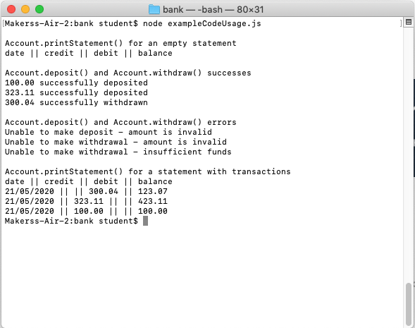

# Bank technical challenge



This repository contains my attempt that the Makers Academy individual technical test that can be found [here](https://github.com/makersacademy/course/blob/master/individual_challenges/bank_tech_test.md)

## Specification

Requirements
- You should be able to interact with your code via a REPL like IRB or the JavaScript console. (You don't need to implement a command line interface that takes input from STDIN.)
- Deposits, withdrawal.
- Account statement (date, amount, balance) printing.
- Data can be kept in memory (it doesn't need to be stored to a database or anything).

Acceptance criteria
- Given a client makes a deposit of 1000 on 10-01-2012
- And a deposit of 2000 on 13-01-2012
- And a withdrawal of 500 on 14-01-2012
- When she prints her bank statement
- Then she would see

```
date || credit || debit || balance
14/01/2012 || || 500.00 || 2500.00
13/01/2012 || 2000.00 || || 3000.00
10/01/2012 || 1000.00 || || 1000.00
```
## Approach

| Purpose  	| Technology       	|
|----------	|------------------	|
| Language 	| Javascript(node) 	|
| Testing  	| Jasmine          	|
| Linting    | ESLint            |
| Code Coverage	| nyc					|

### Getting started

```bash
# clone the repository to your local machine with either

# if you're using ssh
git clone git@github.com:PhilipVigus/bank.git

# if you're using https
git clone https://github.com/PhilipVigus/bank.git

# Dependencies
# The repository requires node and npm, which can be installed with the following commands
# on mac
brew update
brew install node
# on linux (you need to install npm separately)
sudo apt install nodejs
sudo apt install npm

# then run npm install from the project root directory
# this installs the project dependencies
npm install
```

### Running tests

```bash
# run tests from the project root with the following command
npm run test
```

### Interacting with the code

```bash
# start node on the commandline
node

# require account.js
require('./src/account.js');

# use any of the account public methods
```

Example output:

```bash
Makerss-Air-2:bank student$ node
Welcome to Node.js v14.2.0.
Type ".help" for more information.
> const Account = require('./src/account.js');
undefined
> const account = new Account();
undefined
> account.deposit(100);
'100 successfully deposited'
> account.withdraw(50);
'50 successfully withdrawn'
> account.printStatement();
'date || credit || debit || balance\n' +
  '19/05/2020 || || 50.00 || 50.00\n' +
  '19/05/2020 || 100.00 || || 100.00'
> account.withdraw();
'Unable to make withdrawl - amount is not specified'
> 
```

### User stories

These were the user stories I wrote based on the requirements and acceptance criteria I was given.

```
As a user
So that I can see the current state of my balance
I want to print my balance
```

```
As a user
So that my balance is easy to read
I want the transactions to be in reverse chronological order,
with credit, debit and balance columns
```

```
As a user
So that I can access my money
I want to be able to withdraw money
```

```
As a user
So that I can save my money
I want to be able to deposit money
```

```
As a user
So that I know when a transaction was invalid
I want to get meaningful error messages
Criteria
- amounts must be positive numbers with a maximum of 2 decimals places
- withdrawls fail if there are insufficient funds in the account
```

### Implementation process and challenges

My initial steps were too rushed, and although I was following TDD, it meant that I made unnecessary mistakes. Once I slowed down, progress was far smoother.

#### Structure
[![](https://mermaid.ink/img/eyJjb2RlIjoiY2xhc3NEaWFncmFtXG5cdEFjY291bnQgPHwtLSBEZXBvc2l0XG5cdEFjY291bnQgPHwtLSBXaXRoZHJhd2xcblx0RGVwb3NpdCA8fC0tIGlzVmFsaWRBbW91bnRcblx0V2l0aGRyYXdsIDx8LS0gaXNWYWxpZEFtb3VudFxuXHRBY2NvdW50IDx8LS0gU3RhdGVtZW50XG5cdGNsYXNzIEFjY291bnR7XG5cdFx0K3dpdGhkcmF3KGFtb3VudClcblx0XHQrZGVwb3NpdChhbW91bnQpXG5cdFx0K3ByaW50U3RhdGVtZW50KClcblx0XHQtYWRkV2l0aGRyYXdsKClcblx0XHQtYWRkRGVwb3NpdCgpXG5cdFx0LXRyYW5zYWN0aW9uc1tdXG5cdFx0LWludCBiYWxhbmNlXG5cdH1cblxuXHRjbGFzcyBEZXBvc2l0e1xuXHRcdC12YWxpZGF0ZUFtb3VudChhbW91bnQpXG5cdFx0LXZhbGlkYXRlRGVwb3NpdChhbW91bnQpXG5cdFx0LWRhdGVUb1N0cmluZyhkYXRlKVxuXHRcdCtwcmludFN0YXRlbWVudExpbmUoKVxuXHRcdCtzdHJpbmcgdHlwZVxuXHRcdCtkYXRlIGRhdGVcblx0XHQrZmxvYXQgYW1vdW50XG5cdFx0K2Zsb2F0IGJhbGFuY2VBZnRlckRlcG9zaXRcblx0fVxuXHRjbGFzcyBpc1ZhbGlkQW1vdW50e1xuXHRcdCtpc1ZhbGlkQW1vdW50KClcblx0XHQtaXNOdW1iZXIoKVxuXHRcdC1oYXNWYWxpZERlY2ltYWxzKClcblx0XHQtZ2V0RGVjaW1hbHMoKVxuXHR9XG5cdGNsYXNzIFN0YXRlbWVudHtcblx0XHQtc3RyaW5nIFNUQVRFTUVOVF9IRUFERVJcblx0XHQtdHJhbnNhY3Rpb25zXG5cdFx0LWFjY291bnRBY3Rpb25zVG9TdGF0ZW1lbnRTdHJpbmcoKVxuXHRcdCtwcmludCgpXG5cdH1cblx0Y2xhc3MgV2l0aGRyYXdse1xuXHQgICAgLXZhbGlkYXRlQXZhaWxhYmxlRnVuZHMoKVxuXHRcdC12YWxpZGF0ZUFtb3VudCgpXG5cdFx0LXZhbGlkYXRlV2l0aGRyYXdsKClcblx0XHQtZGF0ZVRvU3RyaW5nKClcblx0XHQrcHJpbnRTdGF0ZW1lbnRMaW5lKClcblx0XHQrc3RyaW5nIHR5cGVcblx0XHQrZGF0ZSBkYXRlXG5cdFx0K2Zsb2F0IGFtb3VudFxuXHRcdCtmbG9hdCBiYWxhbmNlQWZ0ZXJXaXRoZHJhd2xcblx0fSIsIm1lcm1haWQiOnsidGhlbWUiOiJkZWZhdWx0In0sInVwZGF0ZUVkaXRvciI6ZmFsc2V9)](https://mermaid-js.github.io/mermaid-live-editor/#/edit/eyJjb2RlIjoiY2xhc3NEaWFncmFtXG5cdEFjY291bnQgPHwtLSBEZXBvc2l0XG5cdEFjY291bnQgPHwtLSBXaXRoZHJhd2xcblx0RGVwb3NpdCA8fC0tIGlzVmFsaWRBbW91bnRcblx0V2l0aGRyYXdsIDx8LS0gaXNWYWxpZEFtb3VudFxuXHRBY2NvdW50IDx8LS0gU3RhdGVtZW50XG5cdGNsYXNzIEFjY291bnR7XG5cdFx0K3dpdGhkcmF3KGFtb3VudClcblx0XHQrZGVwb3NpdChhbW91bnQpXG5cdFx0K3ByaW50U3RhdGVtZW50KClcblx0XHQtYWRkV2l0aGRyYXdsKClcblx0XHQtYWRkRGVwb3NpdCgpXG5cdFx0LXRyYW5zYWN0aW9uc1tdXG5cdFx0LWludCBiYWxhbmNlXG5cdH1cblxuXHRjbGFzcyBEZXBvc2l0e1xuXHRcdC12YWxpZGF0ZUFtb3VudChhbW91bnQpXG5cdFx0LXZhbGlkYXRlRGVwb3NpdChhbW91bnQpXG5cdFx0LWRhdGVUb1N0cmluZyhkYXRlKVxuXHRcdCtwcmludFN0YXRlbWVudExpbmUoKVxuXHRcdCtzdHJpbmcgdHlwZVxuXHRcdCtkYXRlIGRhdGVcblx0XHQrZmxvYXQgYW1vdW50XG5cdFx0K2Zsb2F0IGJhbGFuY2VBZnRlckRlcG9zaXRcblx0fVxuXHRjbGFzcyBpc1ZhbGlkQW1vdW50e1xuXHRcdCtpc1ZhbGlkQW1vdW50KClcblx0XHQtaXNOdW1iZXIoKVxuXHRcdC1oYXNWYWxpZERlY2ltYWxzKClcblx0XHQtZ2V0RGVjaW1hbHMoKVxuXHR9XG5cdGNsYXNzIFN0YXRlbWVudHtcblx0XHQtc3RyaW5nIFNUQVRFTUVOVF9IRUFERVJcblx0XHQtdHJhbnNhY3Rpb25zXG5cdFx0LWFjY291bnRBY3Rpb25zVG9TdGF0ZW1lbnRTdHJpbmcoKVxuXHRcdCtwcmludCgpXG5cdH1cblx0Y2xhc3MgV2l0aGRyYXdse1xuXHQgICAgLXZhbGlkYXRlQXZhaWxhYmxlRnVuZHMoKVxuXHRcdC12YWxpZGF0ZUFtb3VudCgpXG5cdFx0LXZhbGlkYXRlV2l0aGRyYXdsKClcblx0XHQtZGF0ZVRvU3RyaW5nKClcblx0XHQrcHJpbnRTdGF0ZW1lbnRMaW5lKClcblx0XHQrc3RyaW5nIHR5cGVcblx0XHQrZGF0ZSBkYXRlXG5cdFx0K2Zsb2F0IGFtb3VudFxuXHRcdCtmbG9hdCBiYWxhbmNlQWZ0ZXJXaXRoZHJhd2xcblx0fSIsIm1lcm1haWQiOnsidGhlbWUiOiJkZWZhdWx0In0sInVwZGF0ZUVkaXRvciI6ZmFsc2V9)

- The code is separated into 4 classes, with 1 utility function
- The two transaction types (withdrawl and deposit) are in their own functions, which would make it relatively straightforward to add additional types at a later date.
- IsValidAmount is a utility function used in several places, so it made sense for that to be extracted into its own file to prevent code duplication.

In the main, the implementation developed organically, with refactorings and general design decisions naturally coming out of the tests I was writing. However, there were a couple of issues that merit further discussion.

#### Refactoring

The first major refactoring split the Statement function away from Account. As I was coding, a clear separation in responsibility developed within the Account function, and it was a straightforward decision to extract the Statement function out.

The second major refactoring involved creating Deposit and Withdraw functions. I initially resisted this, prefering to keep all display logic within the Statement function. However, on reflection it made sense to create the two types of transaction, with Statement calling them to get how they should be displayed on the statement. I'm pleased with how this worked out, and it greatly simplified the Statement code.


#### Not using function prototypes

This was something I thought long and hard about. Function prototypes are mostly useful in a scenario where you expect those functions to be used as part of prototypal inheritance. However, their use makes implementation of information hiding and privacy more complex, and code less readable.

I chose not to use them simply because I felt that the improved code readability from doing so outweighed any benefits their use might add at this stage. It wouldn't be difficult to refactor so that the code uses prototypes if necessary, and I felt that based on the specifications I was given, having simpler code was more important.

#### Validation of user input

It took a while to work out the best way of checking that deposit and withdrawl amounts are numbers. Javascript doesn't make this easy, and there are downsides to most of the standard approaches. Many of these have loopholes relating to implicit type coersion that meant I didn't feel they were appropriate to use.

Although using a regex feels clunky, I feel it is probably the most consistent and sound approach when used in conjunction with the other validation checks in place.

#### Feature testing

For some reason I went down the route of manual feature testing using the Node console rather than writing the tests in Jasmine. However, this was a relatively easy fix once I realised, which was partway through the first self-reflection.
